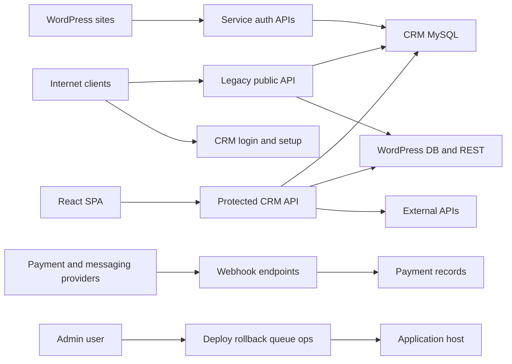

# Exotic CRM Security Audit and Threat Model

Date: 2026-07-09  
Repository: `/Users/ian/Projects/exotic-crm`  
Branch: `main`  
Framework baseline: Laravel Framework 10.50.2, React 19/Vite SPA, Sanctum bearer tokens  
Audit type: repo-grounded application security audit plus threat model  

## Executive summary

The highest-risk theme is a split security posture: the newer `/api/crm/*` CRM API has bearer-token authentication, role middleware, market scoping, and several service-auth controls, but the legacy `/api/*` Ads API is explicitly routed as public and still exposes user management, platform mutation, product mutation, payment mutation, profile activation/deactivation, debug endpoints, logs, and reporting data. A remote unauthenticated attacker could create or alter CRM users, mutate platform settings, mark payments completed, activate or deactivate WordPress profiles, and read sensitive operational logs. The second urgent theme is secrets hygiene: `testdb.php` is tracked with hardcoded database credentials, while `phpinfo.php` exposes runtime configuration if deployed. Dependency audits also show critical/high advisories in Laravel 10, PhpSpreadsheet, Axios, React Router, Symfony, Guzzle, and related packages. Laravel 10 security support ended on 2025-02-04 per Laravel's official 10.x support policy, so platform upgrade is now a security task, not housekeeping.

## Scope and assumptions

In scope:

- Laravel API, controllers, middleware, models, services, jobs, routes, config, dependency manifests, and repo-root debug artifacts in `app/`, `routes/`, `config/`, `composer.lock`, `package-lock.json`, `phpinfo.php`, and `testdb.php`.
- CRM protected API under `/api/crm/*`.
- Legacy Ads API under `/api/*`.
- WordPress sync, KYC upload/review, billing/payment, messaging/webhook, push campaign upload, setup, and deployment/system-health surfaces.
- Dependency posture using `composer audit --locked --no-interaction` and `npm audit --omit=dev --json` run on 2026-07-09.

Out of scope:

- Live infrastructure, web server configuration, production WAF/CDN rules, database grants, cloud IAM, and runtime environment variables.
- Penetration testing against a deployed host.
- Full source review of vendored dependencies.
- Secrets values. Secrets discovered during review are intentionally not reproduced here.

Assumptions not yet user-validated:

- The CRM and legacy Ads API are internet-exposed in production under `crm.exotic-online.com` or a related public host.
- WordPress profile data, KYC documents, payment history, SMS logs, CRM users, Support Board tokens, and provider credentials are sensitive production data.
- The legacy Ads API remains needed for existing production payment flows, but its public mutating/admin endpoints are not intended to be accessible to arbitrary internet clients.
- Admin role compromise has production operational impact because admins can trigger deployment, rollback, queue operations, provider configuration, and role/user management.
- The local repository is representative of production deploy content unless `.cpanel.yml` or deployment scripts exclude files.

Open questions that could materially change risk:

- Is the legacy `/api/*` surface reachable from the public internet in production, or restricted by Nginx/cPanel/IP allowlists?
- Are `phpinfo.php`, `testdb.php`, and `report-server-api.zip` deployed to production, or are they local-only artifacts excluded by deployment?
- Are Sanctum personal access tokens intended to be long-lived forever, or should CRM sessions expire/revoke on idle/role changes?

## System model

### Primary components

- React SPA served by Laravel: `resources/js/app.jsx`, `resources/views/crm.blade.php`, and catch-all web route in `routes/web.php`.
- Laravel 10 API server with API routes in `routes/api.php`.
- CRM protected API under `/api/crm/*`, gated by `auth:sanctum`, `crm.active`, and `crm.impersonation` at `routes/api.php:137`.
- Legacy Ads API under `/api/*`, documented in-route as public at `routes/api.php:761`.
- MySQL application database plus dynamically configured WordPress market databases via `Platform::getConnectionConfig()` in `app/Models/Platform.php:71`.
- WordPress sync service endpoints authenticated by HMAC/shared key middleware, e.g. `wp.service.auth` in `routes/api.php:88` and `WpServiceAuth`.
- Billing/payment integrations: Kopo Kopo, PawaPay, Paystack, Pesapal, Cybersource, manual payments, wallet APIs, and payment-link proxy.
- Messaging integrations: Meta webhook, WhatsApp sidecar HMAC webhook, SMS provider, Support Board.
- KYC document upload/review using shared-key/JWT upload flow and signed CRM blob downloads.
- Background jobs and admin system health tools for sync, push campaign uploads, deployment, rollback, and queue operations.

### Data flows and trust boundaries

- Internet -> Laravel public API: credentials, payment initiation payloads, callbacks, debug requests, setup requests, image proxy URLs, certificate verification codes; HTTP/JSON/form-data; mixed controls, from unauthenticated public routes to HMAC/JWT/signed middleware.
- React SPA -> `/api/crm/*`: bearer tokens, CRM mutations, PII, payments, KYC review, provider settings; HTTP/JSON/form-data; `auth:sanctum`, `crm.active`, `crm.impersonation`, role middleware, and per-market authorization in many controllers.
- Laravel -> MySQL CRM DB: CRM users, clients, leads, payments, KYC metadata, billing provider profiles, audit logs, jobs; database connection from Laravel config; Eloquent/query builder validation varies by controller.
- Laravel -> WordPress market DB/API: profile activation/deactivation, sync, media operations, credential delivery; dynamic DB config from `platforms` table and REST credentials; sensitive because WordPress is the profile source of truth.
- WordPress plugin -> Laravel service endpoints: KYC upload initiation/completion and SEO generation; shared key/basic auth for KYC, stronger HMAC/timestamp/platform allowlist for SEO.
- Payment providers -> Laravel webhooks: transaction status and provider metadata; public HTTP callbacks; signature verification appears inconsistent across legacy vs newer billing handlers.
- Admin browser -> system health/deploy controls: deployment, rollback, queue retry/flush/nudge, backup upload; bearer-token authenticated and role-gated to admin/sub-admin/admin depending route.
- Laravel -> external HTTP APIs: payment providers, Support Board, SMS, GitHub, push providers, currency/geocoding, image proxy; outbound HTTP; SSRF risk where URLs are operator/user configurable.

#### Diagram



## Assets and security objectives

| Asset | Why it matters | Security objective (C/I/A) |
|---|---|---|
| CRM user accounts and roles | Admin/sub-admin/sales roles control client data, payments, deployment, and settings. | C/I/A |
| Sanctum bearer tokens | Tokens authenticate the protected CRM API and currently do not expire by config. | C/I |
| WordPress profile state | Profile publication, premium/featured status, and subscription state drive business revenue and SEO. | I/A |
| Payment records and provider callbacks | Payment status controls deal activation, wallet topups, subscriptions, and customer trust. | I/A |
| Platform DB/API credentials | Credentials connect the CRM to WordPress market databases and APIs. | C/I |
| Billing provider credentials | Secrets_json/config_json can contain API keys, webhook secrets, callback URLs, and routing policy. | C/I |
| KYC documents and metadata | Identity documents are high-sensitivity personal data. | C/I |
| Client and lead PII | Names, emails, phones, profile URLs, payment history, notes, SMS logs, and chat metadata. | C/I |
| SMS/activity/audit logs | Logs disclose operations, users, phone numbers, message content, and incident context. | C/I |
| Deployment and rollback controls | Admin-only operations can execute host-level deployment scripts and queue workers. | I/A |
| Dependency supply chain | Vulnerable framework/library code can become RCE, SSRF, XSS, DoS, or auth bypass. | C/I/A |

## Attacker model

### Capabilities

- Remote unauthenticated attacker can send HTTP requests to public routes if the app is internet-facing.
- Authenticated low-privilege CRM user can call routes allowed to their role and attempt horizontal market access.
- Compromised admin token/user can call admin-only deployment, queue, settings, billing, and role endpoints.
- External payment/messaging provider impersonator can send spoofed webhook payloads where signatures are absent or not enforced.
- Malicious CRM user can upload CSV/XLSX/XML/media files to allowed import or campaign/KYC surfaces.
- Malicious operator with settings access can configure outbound base URLs/domains that may influence SSRF-capable HTTP clients.

### Non-capabilities

- No assumed shell access, database access, or access to server environment variables unless obtained through a vulnerability.
- No assumed compromise of WordPress plugins, payment providers, or SMS providers.
- No assumed ability to break TLS or Laravel encryption primitives directly.
- No assumed ability to bypass Laravel route middleware unless routes are actually ungated.

## Entry points and attack surfaces

| Surface | How reached | Trust boundary | Notes | Evidence (repo path / symbol) |
|---|---|---|---|---|
| Legacy public user registration | `POST /api/register` | Internet -> legacy API -> CRM DB | Allows `role=admin`; no route middleware. | `routes/api.php:761`, `routes/api.php:764`, `app/Http/Controllers/API/AuthController.php:17` |
| Legacy public user update/list | `PUT /api/users/{id}`, `GET /api/users` | Internet -> legacy API -> CRM DB | Updates role/password and lists users without auth. | `routes/api.php:771`, `app/Http/Controllers/API/AuthController.php:123`, `app/Http/Controllers/API/AuthController.php:167` |
| Legacy public platform CRUD | `/api/platforms` | Internet -> legacy API -> CRM DB | Creates/updates/deletes platform DB/API settings. | `routes/api.php:775`, `app/Http/Controllers/API/PlatformController.php:23`, `app/Http/Controllers/API/PlatformController.php:176` |
| Legacy public product CRUD | `/api/products` | Internet -> legacy API -> CRM DB | Mutates payment products/prices. | `routes/api.php:790`, `app/Http/Controllers/API/ProductController.php:11` |
| Legacy public payment status mutation | `/api/payment/update`, `/api/manual-update`, callbacks | Internet/provider -> legacy API -> payment completion services | Can complete/reverse/fail payments and invoke subscription activation flow. | `routes/api.php:815`, `routes/api.php:839`, `app/Http/Controllers/API/PaymentController.php:215`, `app/Http/Controllers/API/PaymentController.php:3461` |
| Legacy public profile activation/deactivation | `/api/activate-profile`, `/api/deactivate-profile` | Internet -> legacy API -> WordPress DB | Publishes/privates WordPress escort posts and mutates activation metadata. | `routes/api.php:828`, `app/Http/Controllers/API/PaymentController.php:1617`, `app/Http/Controllers/API/PaymentController.php:1915` |
| Legacy public dashboard/log data | `/api/dashboard-summary`, `/api/escort-posts`, `/api/recent-users`, `/api/sms-logs`, `/api/activity-logs` | Internet -> legacy API -> CRM/WordPress DB | Exposes profile/user/SMS/activity data. | `routes/api.php:784`, `routes/api.php:825`, `routes/api.php:832`, `app/Http/Controllers/API/DashboardController.php:84`, `app/Http/Controllers/API/SmsLogController.php:13` |
| Debug scripts | `phpinfo.php`, `testdb.php` if deployed | Internet -> PHP runtime/database | Runtime disclosure and hardcoded DB credential disclosure/use. | `phpinfo.php:1`, `testdb.php:2` |
| CRM protected API | `/api/crm/*` | Browser -> CRM API | Authenticated by Sanctum token and role middleware. | `routes/api.php:137`, `app/Http/Kernel.php:35`, `config/sanctum.php:44` |
| CRM login/token issuance | `POST /api/crm/login`, `/crm/auth/exchange` | Browser -> Laravel auth/session/token | Password login and SSO exchange issue Sanctum personal access tokens. | `routes/api.php:95`, `routes/web.php:54`, `app/Http/Controllers/CRM/AuthController.php:22`, `app/Http/Controllers/CRM/AuthController.php:72` |
| CRM setup endpoints | `/api/crm/setup/*` | Internet -> setup controller | Some endpoints public and throttled; migration/admin creation require setup token. | `routes/api.php:122`, `app/Http/Controllers/CRM/SetupController.php:95`, `app/Http/Controllers/CRM/SetupController.php:306` |
| KYC upload/review | `/api/kyc/*`, `/api/crm/kyc/*` | WordPress/client/admin -> CRM/KYC storage | Shared key/basic auth, JWT upload token, signed blob download. | `routes/api.php:101`, `routes/api.php:107`, `routes/api.php:661`, `app/Http/Middleware/VerifyKycUploadToken.php:13` |
| Image proxy | `/api/crm/image-proxy?url=` | Internet -> Laravel -> external host | Host allowlist from platform domains, rate limited, redirects allowed. | `routes/api.php:119`, `app/Http/Controllers/CRM/ImageProxyController.php:16` |
| Push campaign uploads | `/api/crm/push-campaigns/upload` | Auth CRM user -> queue job -> PhpSpreadsheet | XLS/XLSX parsed via `IOFactory::createReaderForFile()` and chunked `load()`. | `routes/api.php:180`, `app/Http/Controllers/CRM/PushCampaignController.php:108`, `app/Jobs/ProcessPushUploadJob.php:62` |
| Payment import uploads | `/api/crm/payments/import/preview` | Auth CRM user -> parser -> DB | CSV/TXT/XLSX/XML; XML uses `simplexml_load_file`; custom XLSX ZIP/XML parser. | `routes/api.php:444`, `app/Http/Controllers/CRM/PaymentQueueController.php:932`, `app/Services/PaymentImportParserService.php:13`, `app/Services/PaymentImportParserService.php:307` |
| Messaging webhooks | `/api/crm/messaging/webhook/*` | Provider/sidecar -> CRM | Meta signature verification for receive, HMAC for sidecar. | `routes/api.php:111`, `routes/api.php:113`, `app/Http/Controllers/CRM/MessagingWebhookController.php:31`, `app/Http/Middleware/VerifyWhatsAppSidecarHmac.php:13` |
| Admin deployment/queue controls | `/api/crm/settings/system-health/*` | Admin -> host/queue/database | Deploy/rollback, backup upload/delete, queue retry/flush/nudge. | `routes/api.php:628`, `app/Http/Controllers/CRM/SystemHealthUpdateController.php:44`, `app/Services/DeploymentStatusService.php:88` |

## Top abuse paths

1. Remote admin creation -> protected API takeover -> deployment controls:
   Attacker calls public `POST /api/register` with `role=admin`, obtains an admin account, logs into protected CRM if accepted, then accesses admin-only `/api/crm/settings/*` and deployment/queue controls. Impact: full CRM data compromise and operational control.

2. Remote payment forgery -> subscription activation:
   Attacker calls public `/api/manual-update` or `/api/payment/update` with a target payment ID and `status=completed`; controller invokes successful payment flow. Impact: fraudulent subscriptions, profile activation, wallet/deal integrity loss.

3. Remote WordPress profile manipulation:
   Attacker calls public `/api/activate-profile` or `/api/deactivate-profile` with platform/post/product IDs. Impact: profiles published or hidden without authorization, revenue/SEO/customer harm.

4. Remote platform poisoning:
   Attacker creates or updates `platforms` with malicious DB/API settings or deletes legitimate markets. Impact: sync redirection, data corruption, availability outage, possible SSRF through configured URLs.

5. Debug credential exposure -> database compromise:
   If `testdb.php` is deployed, attacker reads or infers DB credentials from source exposure/backups or triggers DB connectivity behavior; `phpinfo.php` discloses environment. Impact: database access and secret rotation emergency.

6. Dependency exploitation via upload/import surfaces:
   Authenticated CRM user uploads malicious XLS/XLSX/XML to push/payment import routes; vulnerable PhpSpreadsheet/SimpleXML parsing or XML expansion can lead to SSRF/RCE/DoS depending package and parser behavior. Impact: host compromise or availability loss.

7. Token theft persistence:
   XSS/browser compromise or leaked bearer token gives long-lived API access because Sanctum expiration is `null`. Impact: persistent account takeover until manual token revocation.

8. Log/PII scraping:
   Remote unauthenticated caller enumerates `/api/sms-logs`, `/api/activity-logs`, `/api/users`, dashboard, and profile endpoints. Impact: broad PII/operations disclosure and targeted social engineering.

9. Admin token theft -> host operations:
   Attacker with admin token triggers deployment/rollback, uploads SQL backups, flushes queues, or starts queue workers. Impact: host integrity and availability damage even without direct shell.

10. Public webhook spoofing:
    Attacker posts callback-like payloads to legacy payment endpoints that do not enforce provider signature verification. Impact: payment state manipulation and false reconciliation.

## Threat model table

| Threat ID | Threat source | Prerequisites | Threat action | Impact | Impacted assets | Existing controls (evidence) | Gaps | Recommended mitigations | Detection ideas | Likelihood | Impact severity | Priority |
|---|---|---|---|---|---|---|---|---|---|---|---|---|
| TM-001 | Remote unauthenticated attacker | Legacy `/api/*` is internet reachable. | Create admin/sub_admin/sales accounts through public registration. | Full CRM/API takeover if account can authenticate and tokens are accepted. | CRM users, tokens, client/payment/KYC data, deployment controls | Validation only; role allows admin/sub_admin/sales (`AuthController.php:20`). | No auth, no invite/admin approval, no throttle beyond default API throttle. | Immediately disable or auth-gate legacy registration; restrict role creation to existing admins; add tests asserting 401/403 unauthenticated. | Alert on new admin/sub_admin users, registration from unknown IPs, first login from new account. | High | High | critical |
| TM-002 | Remote unauthenticated attacker | Legacy user endpoints reachable. | List users and change roles/passwords via `/api/users`. | Account takeover, privilege escalation, staff enumeration. | CRM users, tokens, platform access | User model hides password (`User.php:29`). | Public route can update role/password and list names/emails. | Move user management behind `auth:sanctum`, `crm.active`, `role:admin`; remove legacy routes if obsolete. | Alert on user updates where `actor_id` is null; diff role/password changes. | High | High | critical |
| TM-003 | Remote unauthenticated attacker | Legacy payment mutation endpoints reachable and payment IDs guessable or enumerable. | Mark payments completed/reversed/failed and trigger activation logic. | Fraudulent revenue state, subscription activation/deactivation, customer harm. | Payments, deals, wallets, WordPress profile state | Some validation exists (`PaymentController.php:3464`), but no route auth. | No provider signature, no admin auth, no idempotency or actor requirement on manual update. | Remove public manual mutation routes; require signed provider callbacks or admin role; separate provider callbacks from operator actions. | Alert on payment status changes with `triggered_by=system/manual` from HTTP, null user, or unexpected IP. | High | High | critical |
| TM-004 | Remote unauthenticated attacker | Legacy activation routes reachable and platform/post IDs known or enumerable. | Publish/private WordPress profiles and mutate `notactive`, premium, featured, activation metadata. | Unauthorized profile changes, revenue/SEO damage. | WordPress profiles, activations, payments | Product/platform/post existence checks (`PaymentController.php:1619`, `PaymentController.php:1917`). | No auth or role check on public routes. | Gate with service HMAC for trusted payment backend or admin role; require payment/deal linkage before activation. | Alert on activations/deactivations from unauthenticated routes; reconcile against payment events. | High | High | critical |
| TM-005 | Remote unauthenticated attacker | Legacy platform/product routes reachable. | Create/update/delete markets, DB credentials, products/prices. | Data corruption, sync outage, possible credential/path poisoning. | Platform configs, products, WordPress DB connections | Platform hides some secrets in serialization (`Platform.php:35`). | CRUD routes public; `wp_api_password` is not encrypted cast; `db_pass` is not encrypted cast. | Gate CRUD to admin; encrypt stored platform secrets; rotate affected credentials; add policy/tests. | Alert on platform/product mutations with null actor or unexpected source IP. | High | High | critical |
| TM-006 | Remote unauthenticated attacker or source-code reader | Debug files are deployed or repo source leaks. | Access `phpinfo.php`; discover hardcoded DB credentials in `testdb.php`. | Runtime disclosure and database credential compromise. | DB credentials, PHP config, environment details | `.env` files ignored (`.gitignore:15`), but debug files are tracked. | Hardcoded credential in tracked PHP file; phpinfo route in webroot. | Delete `phpinfo.php` and `testdb.php`; rotate exposed DB credentials; purge from any deployment artifact/history if needed; block debug scripts in web server. | Search web access logs for `phpinfo.php` and `testdb.php`; monitor DB logins using exposed username. | High if deployed | High | critical |
| TM-007 | Remote/user-controlled webhook caller | Legacy callback endpoints reachable. | Spoof callback/update payloads without verified provider signature. | False payment completion/reversal/failure. | Payment records, subscriptions, wallets | Newer provider-specific BillingController may verify some signatures; legacy `PaymentController::updatePaymentStatus()` validates fields only. | Legacy callback path lacks provider signature enforcement and source allowlist. | Require HMAC/provider signature on all callbacks; quarantine unsigned legacy callbacks; migrate providers to webhook inbox with verification. | Alert on callback routes with missing/invalid provider signature; compare provider status before final completion. | High | High | critical |
| TM-008 | Authenticated CRM user or remote if public admin bug exploited | Upload access to push campaign workbook routes. | Upload malicious XLS/XLSX parsed by vulnerable PhpSpreadsheet. | Potential RCE/SSRF/DoS depending advisory and code path. | Host, queue worker, CRM DB | File type/size validation (`PushCampaignController.php:117`), chunk read filter (`ProcessPushUploadJob.php:123`). | Composer audit flags PhpSpreadsheet 1.30.2 critical; job calls `IOFactory::createReaderForFile()` and `$reader->load()`. | Upgrade PhpSpreadsheet to a fixed supported major/version; disable external entity/network features if available; sandbox uploads; add file content validation and async resource limits. | Alert on upload parse failures, large dimensions, worker timeouts, unusual outbound traffic during parsing. | Medium | High | high |
| TM-009 | Authenticated CRM user | Upload payment XML import. | Upload malicious XML causing XXE/SSRF/entity expansion/DoS if parser unsafe. | Host SSRF/DoS or data exposure depending libxml behavior. | Host availability, internal network, imported payment data | File size and extension validation (`PaymentQueueController.php:934`), row cap after parse (`PaymentImportService.php:18`). | `simplexml_load_file()` uses default parser options before row cap; no explicit `LIBXML_NONET`/entity-hardening options. | Replace with hardened XML reader: disable entity loading, use `LIBXML_NONET`, size/depth limits, streaming parser; reject DTD/DOCTYPE. | Log XML parser errors, file size, SMS count, parse duration; alert on parser warnings/timeouts. | Medium | Medium | medium |
| TM-010 | Remote unauthenticated attacker | Public read endpoints reachable. | Scrape users, SMS logs, activity logs, dashboard profile/user data. | PII disclosure and operational intelligence. | CRM users, SMS logs, activity logs, WordPress user/profile data | Some model hidden fields. | Routes public and paginated endpoints lack auth; dashboards read dynamic WordPress DB data. | Gate all logs/reporting/dashboard legacy routes; add response minimization; remove phone/email from public outputs. | Alert on high-volume reads of `/api/users`, `/api/sms-logs`, `/api/activity-logs`, `/api/escort-posts`. | High | Medium | high |
| TM-011 | Remote attacker with stolen token or browser XSS | Bearer token theft. | Reuse Sanctum personal access token indefinitely. | Persistent CRM account takeover. | Tokens, user accounts, CRM data | Logout deletes current token (`CRM/AuthController.php:133`); inactive users blocked by middleware. | `config/sanctum.php:57` sets expiration to `null`; tokens created with default broad abilities. | Set token TTL, rotate on role/status/password changes, revoke all tokens on logout/password reset/admin disable; consider abilities per token. | Alert on token reuse after inactivity, impossible travel, old token age, multiple IPs. | Medium | High | high |
| TM-012 | Malicious low-privilege authenticated user | Endpoint missing market scoping or overly broad roles. | Access clients/leads/payments outside assigned markets. | Cross-market PII/payment disclosure or mutation. | Clients, leads, payments, KYC, market data | MarketAuthorizationService exists and is used in many controllers (`MarketAuthorizationService.php:25`). | Large route surface makes omissions likely; not all endpoints were exhaustively proven scoped. | Add authorization tests per role/market for every `/api/crm/*` controller; centralize policies; deny by default on platform-bound models. | Log 403s and successful cross-market access attempts; audit actor/platform mismatches. | Medium | High | high |
| TM-013 | Compromised admin token/account | Admin-only system health endpoints reachable. | Deploy/rollback, upload SQL backup, flush queues, nudge worker. | Host integrity/availability impact. | Host, queues, deployment state, database backups | Routes are role-gated to admin/sub_admin/admin (`routes/api.php:628`); shell args escaped in deployment command (`DeploymentStatusService.php:462`). | High blast radius; no secondary confirmation/MFA shown; backup upload accepts any `.sql` up to 500MB. | Require MFA/re-auth for deploy/rollback/queue flush; restrict by IP/VPN; add signed approvals and immutable audit; validate SQL backup naming/content. | Alert on deploy/rollback/queue destructive actions; require out-of-band notification. | Medium | High | high |
| TM-014 | Remote attacker or malicious operator-controlled URL | SSRF-capable outbound calls. | Abuse image proxy or configurable provider/base URLs to reach internal hosts. | Metadata/internal service exposure, request smuggling, cache abuse. | Host network, credentials, external integrations | Image proxy has exact host allowlist and content-type check (`ImageProxyController.php:32`). | Redirects are allowed; platform domains are admin-editable and legacy platform CRUD is public; Axios/Guzzle/Symfony SSRF advisories present. | Disable redirects or revalidate every redirect hop; block private/reserved IPs after DNS resolution; lock platform CRUD; patch HTTP client deps. | Log proxy destination IP/host and redirects; alert on private IP, localhost, high volume, non-media content. | Medium | Medium | medium |
| TM-015 | Supply-chain attacker or vulnerability exploit | App runs Laravel 10.50.2 and outdated packages with advisories. | Exploit known framework/library vulnerabilities. | RCE/SSRF/XSS/DoS/auth bypass depending package path. | Host, users, data, availability | Dependency lockfiles exist and audits can run. | Composer audit found 30 advisories; npm audit found 35 production advisories; Laravel 10 security support ended 2025-02-04. | Upgrade Laravel to supported major, patch composer/npm dependencies, add CI audit gates. | CI fails on high/critical advisories; weekly scheduled audit; dependency update PRs. | High | High | high |

## Criticality calibration

Critical for this repo:

- Remote unauthenticated creation or takeover of admin/sub_admin accounts.
- Remote unauthenticated payment completion or WordPress profile activation/deactivation.
- Exposed hardcoded production database credentials or deployed debug scripts.

High for this repo:

- Authenticated upload paths that hit critical vulnerable parsers.
- Stolen admin token leading to deploy/rollback/queue/system operations.
- Cross-market data access or mutation across assigned-market boundaries.

Medium for this repo:

- SSRF through admin-configurable URLs or image proxy with partial allowlist controls.
- XML import parser DoS/XXE risk where auth is required but parser hardening is not explicit.
- Public disclosure of operational logs where direct data modification is not possible.

Low for this repo:

- Low-sensitivity version/config disclosure that does not include credentials.
- Issues requiring local developer access only and no production deployment path.
- Debug-only endpoints guarded by `app.debug=false` and verified absent from production routing.

## Focus paths for security review

| Path | Why it matters | Related Threat IDs |
|---|---|---|
| `routes/api.php` | Defines the public legacy API and protected CRM boundary; many critical findings originate here. | TM-001, TM-002, TM-003, TM-004, TM-005, TM-007, TM-010 |
| `app/Http/Controllers/API/AuthController.php` | Public registration/user mutation/listing. | TM-001, TM-002 |
| `app/Http/Controllers/API/PaymentController.php` | Public callbacks, payment mutation, profile activation/deactivation, debug helpers. | TM-003, TM-004, TM-007 |
| `app/Http/Controllers/API/PlatformController.php` | Public platform CRUD and dynamic DB credential handling. | TM-005, TM-014 |
| `app/Http/Controllers/API/ProductController.php` | Public product/price CRUD. | TM-005 |
| `app/Http/Controllers/API/DashboardController.php` | Public WordPress profile/user reporting data. | TM-010 |
| `app/Http/Controllers/API/SmsLogController.php` | Public SMS log disclosure. | TM-010 |
| `app/Http/Controllers/API/ActivityLogController.php` | Public activity log disclosure. | TM-010 |
| `phpinfo.php` | Debug runtime disclosure if deployed. | TM-006 |
| `testdb.php` | Hardcoded DB credentials in tracked file. | TM-006 |
| `app/Http/Controllers/CRM/AuthController.php` | Token issuance and logout behavior. | TM-011 |
| `config/sanctum.php` | Token guard/expiration behavior. | TM-011 |
| `app/Services/MarketAuthorizationService.php` | Central market scoping control. | TM-012 |
| `app/Http/Controllers/CRM/PaymentQueueController.php` | Payment import upload endpoint and proof file serving. | TM-009, TM-012 |
| `app/Services/PaymentImportParserService.php` | CSV/XLSX/XML parsing logic, including `simplexml_load_file`. | TM-009 |
| `app/Http/Controllers/CRM/PushCampaignController.php` | Push workbook upload and parser dispatch. | TM-008 |
| `app/Jobs/ProcessPushUploadJob.php` | PhpSpreadsheet workbook load path. | TM-008 |
| `app/Http/Controllers/CRM/ImageProxyController.php` | Public proxy and SSRF controls. | TM-014 |
| `app/Http/Controllers/CRM/SystemHealthUpdateController.php` | Admin deploy/rollback/queue operations. | TM-013 |
| `app/Services/DeploymentStatusService.php` | Shell command construction and backup handling. | TM-013 |
| `app/Models/Platform.php` | Platform secrets visibility/encryption and dynamic connection config. | TM-005, TM-014 |
| `app/Models/BillingProviderProfile.php` | Provider secret storage lacks encrypted casts in the model. | TM-015 |
| `composer.lock` | Composer advisory exposure. | TM-008, TM-015 |
| `package-lock.json` | npm advisory exposure. | TM-011, TM-014, TM-015 |

## Dependency audit findings

Composer audit command:

```bash
composer audit --locked --no-interaction
```

Result: 30 advisories affecting 12 packages.

Notable locked versions:

- `laravel/framework` 10.50.2. Laravel 10 official security fixes ended 2025-02-04. Laravel's 10.x release notes list Laravel 10 security fixes until February 4th, 2025 and mark 10.x old-version documentation.
- `phpoffice/phpspreadsheet` 1.30.2. Composer audit reported critical SSRF/RCE and patch-bypass advisories affecting this version.
- `guzzlehttp/guzzle` 7.10.0 and `guzzlehttp/psr7` 2.8.0. Composer audit reported HTTPS proxy downgrade, cookie-domain, CRLF, and host-confusion advisories.
- `symfony/mailer` 6.4.31, `symfony/mime` 6.4.32, `symfony/routing` 6.4.32. Composer audit reported email/header/URL generation advisories.
- `phpseclib/phpseclib` 3.0.49. Composer audit reported DoS, SSRF, timing/padding advisory exposure.
- `league/commonmark` 2.8.0. Composer audit reported HTML/embed bypass advisories.

npm audit command:

```bash
npm audit --omit=dev --json
```

Result: 35 production advisories: 6 high, 29 moderate.

Notable locked versions:

- `axios` 1.13.5 with high/moderate SSRF, prototype pollution, header injection, credential leak, and DoS advisories reported by npm audit.
- `react-router` / `react-router-dom` 7.13.0 with high/moderate RCE, XSS, redirect, DoS, and CSRF advisories reported by npm audit.
- `@tiptap/*` 2.27.2 and `prosemirror-markdown` 1.13.4 via `markdown-it` 14.1.1 and `linkify-it` 5.0.0 with markdown/link parsing DoS advisories.
- `form-data` 4.0.5 and `follow-redirects` 1.15.11 with CRLF/header leak advisories.

External references used:

- Laravel 10.x Release Notes and Support Policy: https://laravel.com/docs/10.x/releases#support-policy
- Laravel 10.x Sanctum documentation: https://laravel.com/docs/10.x/sanctum
- Laravel 10.x Validation documentation: https://laravel.com/docs/10.x/validation

## Existing positive controls

- Protected CRM API group uses `auth:sanctum`, `crm.active`, and impersonation middleware at `routes/api.php:137`.
- Role middleware blocks users outside the route's role list at `app/Http/Middleware/RoleMiddleware.php`.
- Inactive CRM users are rejected by `EnsureCrmUserIsActive`.
- Admin impersonation disallows non-admin actors, inactive targets, and admin targets.
- WordPress SEO service endpoint uses shared key, platform ID, timestamp freshness, HMAC, and optional allowlist in `WpServiceAuth`.
- Wallet write routes require platform, bearer token, timestamp, idempotency key, and HMAC signature in `AuthenticateWalletRequest`.
- KYC blob upload uses scoped JWT and CRM KYC document blob download uses signed route middleware.
- MarketAuthorizationService provides reusable platform scoping and is used in many CRM controllers.
- Deployment command construction shell-escapes environment values and script path.
- Platform model hides some secrets from JSON serialization.
- Payment import service caps persisted import rows at 12,000 after parsing.

## Gaps and weaknesses

1. Critical legacy public API routes are unauthenticated and mutating.
2. Public route comments say "ALL ROUTES ARE PUBLIC", which suggests this may be known legacy behavior, but the exposed actions now overlap with admin/payment/WordPress integrity operations.
3. Hardcoded database credentials exist in a tracked PHP file.
4. Debug/runtime disclosure files are tracked in the web project root.
5. Laravel 10 is out of security support as of 2025-02-04.
6. Composer and npm production dependency audits have high/critical findings.
7. Sanctum tokens are non-expiring and created without narrowed abilities.
8. Legacy provider callback/payment update routes do not consistently enforce provider signatures.
9. XML parsing lacks explicit XXE/entity/network hardening.
10. Platform/provider secrets are inconsistently encrypted; `Platform::support_board_token` is encrypted, but `db_pass`, `wp_api_password`, and `BillingProviderProfile::secrets_json` are not cast encrypted in the inspected models.
11. Admin operational endpoints are powerful and appear to lack step-up auth/MFA.
12. Public image proxy permits redirects and depends on platform domains that are mutable through public legacy platform routes.

## Recommended mitigation plan

### Phase 0: Same-day containment

1. Remove or block critical legacy public admin/mutation routes:
   - `/api/register`
   - `/api/users*`
   - `/api/platforms*`
   - `/api/products*`
   - `/api/payment/update`
   - `/api/manual-update`
   - `/api/activate-profile`
   - `/api/deactivate-profile`
   - `/api/clear-pending-payments`
   - `/api/subscribe-webhooks`
   - `/api/debug-kopokopo`
   - `/api/webhook-info`
   - `/api/sms-logs`
   - `/api/activity-logs`
   - dashboard/profile/user read endpoints not explicitly required for public checkout.
2. If legacy payment flows still require selected routes, split them into:
   - public customer checkout endpoints,
   - provider webhook endpoints with provider signature verification,
   - admin/operator endpoints behind `auth:sanctum` and `role:admin,sub_admin`.
3. Delete `phpinfo.php` and `testdb.php` from the repo and production deploys.
4. Rotate the database credential exposed in `testdb.php`; treat it as compromised.
5. Search access logs for hits to `phpinfo.php`, `testdb.php`, `/api/register`, `/api/users`, `/api/manual-update`, `/api/activate-profile`, and `/api/deactivate-profile`.
6. Review recent users, role changes, platform changes, payment status changes, and profile activations for null/unknown actors.

### Phase 1: First security hardening sprint

1. Add route-level tests that unauthenticated requests to legacy admin/mutation endpoints return 401/403.
2. Introduce a `legacy.ads` middleware group for any endpoints that must remain, with explicit auth/HMAC/provider signature controls.
3. Add provider signature verification to all payment callbacks before status mutation.
4. Move user management, platform CRUD, product CRUD, manual payment status updates, and profile activation/deactivation under protected CRM routes or remove duplicates.
5. Set Sanctum token expiration and revoke existing tokens on role/status/password changes.
6. Encrypt stored platform and billing provider secrets:
   - `platforms.db_pass`
   - `platforms.wp_api_password`
   - `billing_provider_profiles.secrets_json`
7. Harden XML parsing with `LIBXML_NONET`, DTD/DOCTYPE rejection, max document size/depth, and streaming parse where possible.
8. Patch dependencies:
   - Plan Laravel 10 -> supported Laravel version.
   - Upgrade PhpSpreadsheet to a fixed version or supported major.
   - Upgrade Guzzle/PSR-7/Symfony packages within Laravel constraints.
   - Upgrade Axios, React Router, Tiptap/ProseMirror/markdown packages.

### Phase 2: Access control and data minimization

1. Inventory every `/api/crm/*` route and add role plus market-scope tests for admin, sub_admin, sales, field_sales, and marketing.
2. Add a default policy pattern for platform-bound models so market scoping is not optional.
3. Minimize read responses:
   - hide emails/phones unless role requires them,
   - hide raw provider payloads by default,
   - hide support/payment tokens and webhook secrets.
4. Make public endpoints deliberately public:
   - customer checkout,
   - certificate verification,
   - signed payment-link proxy,
   - provider webhooks with verification.
5. Add CORS allowlist for production origins instead of `allowed_origins => ['*']` if browser-based cross-origin calls are needed.

### Phase 3: Operational security

1. Require step-up authentication or MFA for:
   - deploy,
   - rollback,
   - queue flush/clear-all,
   - backup upload/delete,
   - role changes,
   - provider credential edits.
2. Restrict system-health/deploy routes by IP/VPN in addition to role.
3. Add immutable audit events for all critical operations with actor, IP, user agent, route, before/after state, and reason.
4. Add alerting for:
   - new admin/sub_admin users,
   - role or password changes,
   - payment status changes outside provider-verified flows,
   - platform credential changes,
   - KYC blob reads,
   - deploy/rollback/queue destructive operations.
5. Add CI gates:
   - `composer audit --locked`
   - `npm audit --omit=dev`
   - security route tests
   - a secrets scanner for committed credentials/debug files.

## Quality check

- Discovered entry points covered: CRM protected API, legacy public API, setup, service-auth, wallet, KYC, image proxy, webhooks, uploads/imports, deployment/queue controls, debug files, dependency manifests.
- Each trust boundary is represented in at least one threat: internet/public API, browser/protected API, provider webhook, WordPress service, file upload parser, admin/host ops, outbound HTTP proxy/API, database.
- Runtime vs CI/dev separation: dependency audits and tracked debug artifacts are separated from runtime route/controller findings.
- User clarifications: not yet received; assumptions are explicitly listed above.
- Open questions are listed and conditional conclusions are marked where production exposure/deployment may change likelihood.
- Secrets: no secret values are reproduced in this report.
